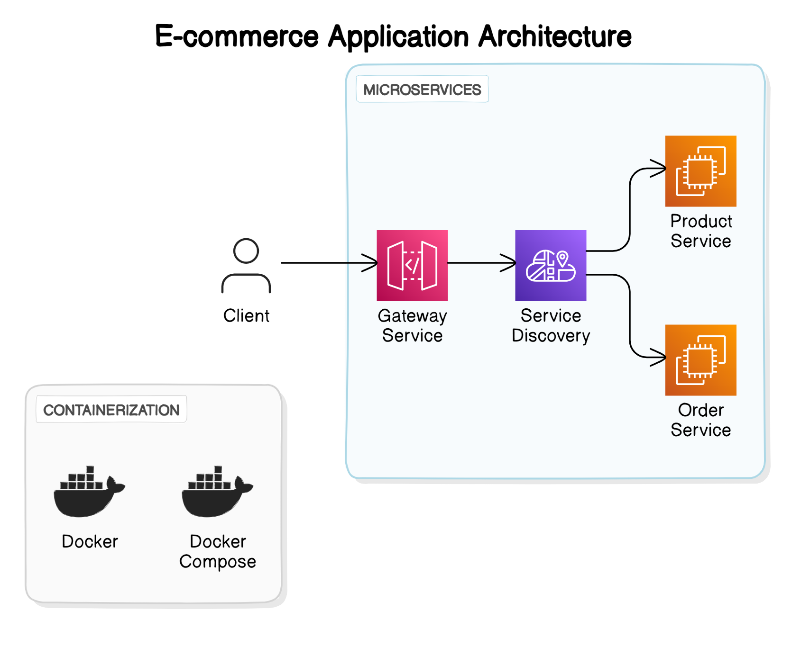

# Ecommerce Microservice Architecture



This repository contains the source code for an ecommerce application built using microservices architecture. The architecture consists of several components:

- **Gateway Service**: Responsible for routing requests from clients to appropriate microservices. Runs on port 8765.

- **Service Discovery**: Handles service registration and discovery. Runs on port 8761.

- **Product Service**: Manages product-related operations such as listing products. Exposes endpoints at `/api/v1/products` and runs on port 8082.

- **Order Service**: Manages order-related operations such as placing orders. Exposes endpoints at `/api/v1/orders` and runs on port 8081.

## Running the Services

To run the services locally, you need Docker and Docker Compose installed on your system. Follow the steps below:

1. Clone this repository:

   ```bash
   git clone https://github.com/your-username/ecommerce-microservices.git

   ```

2. change directory to micro-ecommerce:

   ```bash
   cd micro-ecommerce:

   ```

3. run docker compose:

   ```bash
   docker compose up --build

   ```

4. Once the services are up and running, you can access the following endpoints:

- Gateway Service: [http://localhost:8765](http://localhost:8765)
- Service Discovery: [http://localhost:8761](http://localhost:8761)
- Product Service: [http://localhost:8082/api/v1/products](http://localhost:8082/api/v1/products)
- Order Service: [http://localhost:8081/api/v1/orders](http://localhost:8081/api/v1/orders)

## Dockerized Deployment

The services are containerized using Docker, and Docker Compose is used to orchestrate the deployment. Each microservice is defined in a separate Dockerfile, and the docker-compose.yml file defines the services, networks, and volumes required for deployment.

## Components

### Gateway Service

The Gateway Service acts as an entry point for client requests and routes them to the appropriate microservice based on the request URL.

### Service Discovery

The Service Discovery component facilitates service registration and discovery. It allows microservices to find and communicate with each other dynamically.

### Product Service

The Product Service manages product-related operations such as listing products. Clients can interact with this service to view available products.

### Order Service

The Order Service handles order-related operations such as placing orders. It exposes endpoints for clients to create new orders.

## Technologies Used

- Spring Boot: Framework for building microservices in Java
- Docker: Containerization platform for packaging and deploying applications
- Docker Compose: Tool for defining and running multi-container Docker applications
- Eureka: Service discovery and registration tool provided by Spring Cloud
