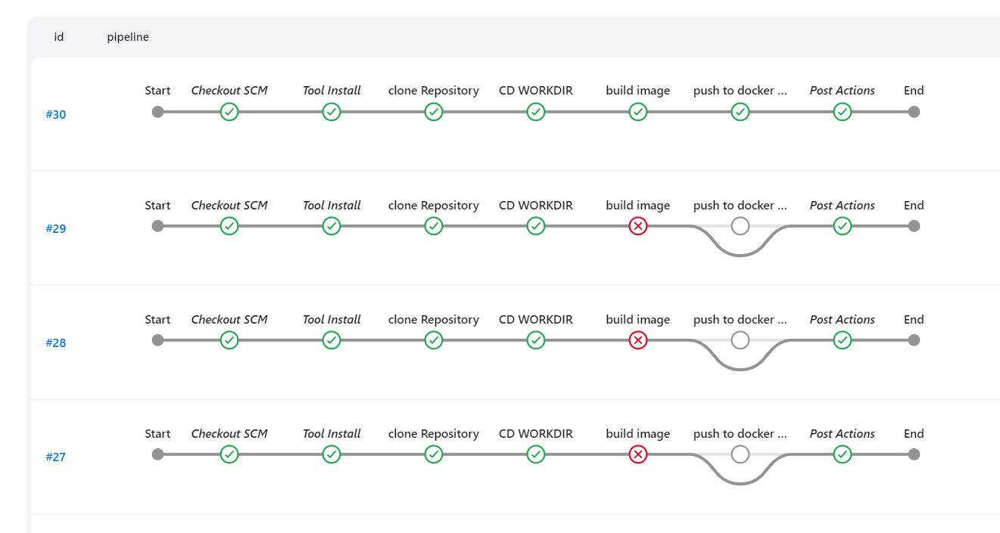

- updates - [added docker]('./testing/Dockerfile')
- updates - [added Jenkins pipeline]('./testing/Jenkinsfile')



# Automated Testing with Selenium and JUnit

## Overview

This README provides documentation for the automated testing suite implemented using Selenium and JUnit in a Spring Boot project. The test suite includes tests for validating the functionality of a web application, specifically focusing on dropdown selection and reading content from a file.

---

## Test Case 1: Validating Web Page Title

**Purpose**: Verifies that the title of the web page is correct.

**Code**:

```java
@Test
public void test_web_title_should_be_valid() {
    String title = driver.getTitle();
    assertEquals("Selenium & JUnit Testing", title);
}
```

## Test Case 2: Validating Dropdown Options

**Purpose**: Tests the dropdown functionality by retrieving all options and comparing them with the expected list.

**Code**:

```java
@Test
public void test_get_all_select_options() {
    List<String> actual = List.of("content", "demo");

    WebElement findSelectOptions = driver.findElement(By.id("items"));
    Select selectOptions = new Select(findSelectOptions);
    List<WebElement> options = selectOptions.getOptions();

    List<String> expected = options.stream().map(option -> option.getText()).toList();

    assertEquals(expected.get(0), actual.get(0));
    assertEquals(expected.size(), actual.size());
}
```

## Test Case 3: Validating Button Existence

**Purpose**: Validates the existence and text of the "read" button on the web page.

**Code**:

```java
@Test
public void test_read_button_exists() {
    WebElement button = driver.findElement(By.id("read"));
    assertNotNull(button);
    assertEquals(button.getText(), "read");
}
```

## Test Case 4: Reading Content Based on Dropdown Selection

**Purpose**: Tests the functionality of reading content based on the selected option from the dropdown.

**Code**:

```java
@Test
public void test_read_content() {
    WebElement selectElement = driver.findElement(By.id("items"));
    Select select = new Select(selectElement);
    select.selectByVisibleText("content");

    WebElement button = driver.findElement(By.id("read"));
    button.click();

    WebElement resultDiv = driver.findElement(By.id("result"));
    String resultText = resultDiv.getText();

    assertTrue(resultText.contains("this is reading from the content"));
}
```
